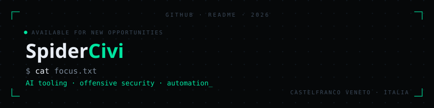

ABOUT

### Chi sono

Sviluppatore e specialista in **Cybersecurity**. Formato all'ITT E. Barsanti, specializzazione Cybersecurity all'ITS Digital Academy di Treviso. Appassionato di sicurezza offensiva — CTF e pratica su Hack The Box.

COMPETENZE

### Competenze

**Cybersecurity**
 

**Sviluppo**
 

**Linguaggi**
 

ESPERIENZA

### Esperienza

| Ruolo | Azienda | Periodo |
|---|---|---|
| Programmatore Informatico | ReputationUP · Castelfranco Veneto | Ott 2025 – Ago 2026 |
| Tecnico Informatico | Rossignol-Lange · Montebelluna | Mar 2025 – Giu 2025 |
| Cloud System Engineer | Vem Sistemi · Padova | Giu 2024 – Lug 2024 |
| Tecnico Informatico | Merieux · Piombino Dese | Giu 2022 – Ago 2022 |

Altri ruoli (3)

 

| Ruolo | Azienda | Periodo |
|---|---|---|
| Bagnino AB | Baita al Lago · Castello di Godego | Giu 2025 – Ago 2025 |
| Cuoco e Fattorino | Mistral · Castelfranco Veneto | Set 2023 – Feb 2024 |
| Cameriere | Jacki's Pub · Castelfranco Veneto | Ago 2021 – Dic 2021 |

FORMAZIONE

### Formazione

- **ITS Cybersecurity Specialist** — Digital Academy, Treviso · Ott 2023 – Lug 2025
- **Diploma Informatico** (Informatica e Telecomunicazioni) — ITT Eugenio Barsanti, Castelfranco Veneto · Set 2017 – Lug 2023

**Certificazioni:** Cisco CCNA R&S · Cisco Introduction to Cybersecurity · Cisco Introduction to IoT

INTERESSI

### Interessi

- 🔐 **Cybersecurity & CTF** — Hack The Box, competizioni CTF, reverse engineering
- ⚙️ **Smontare e rimontare** — analisi meccanica e riparazione, dalla componentistica all'elettronica
- 🎮 **Controllo remoto** — veicoli RC, tecnologie radio e personalizzazione elettronica
- 🏔️ **Passeggiate in montagna** — natura, trekking, disconnessione dal digitale

CONTATTI

[Portfolio](https://spidercivi.github.io) · [HACK/PROJECT](https://spidercivi.github.io/HACK-PROJECT/) · [LinkedIn](https://www.linkedin.com/in/civiero-riccardo-39520027a/) · [Linktree](https://linktr.ee/RickyCivi) · [Email](mailto:civiero.riccardo03@gmail.com)

